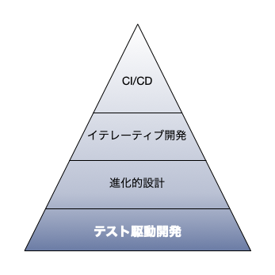

+++
title = "Degino Inc."
subtitle = "Welcome to Degino Inc."
template = "single.html"
+++

# アジャイル開発はスキルと文化

アジャイル開発は、誰にでも始められます。

一方で、簡単に実践できるものではありません。

スポーツと同じで、うまくやるためには、トレーニングが必要なものなのです。

価値のあるシステムを開発し、安定稼働させ、継続的に運用し、発展させてゆく。それを機敏に実行するには、開発から運用はもちろんのこと、発案フェーズやチームビルディングなど、あらゆる部分に、より本質的で総合的なスキルが必要です。

# CI/CD を支えるスキル

開発速度を落とすことなく、運用を継続しながら、適した設計に変更してゆく。

それを実現するには、テスト駆動開発スキルは必須です。

形式的なアジャイルから、実質的なアジャイル開発へ。

そのためには、必要なスキルを身につけた良い開発チームが必要なのです。

開発チームのスキルアップを支援いたします。
